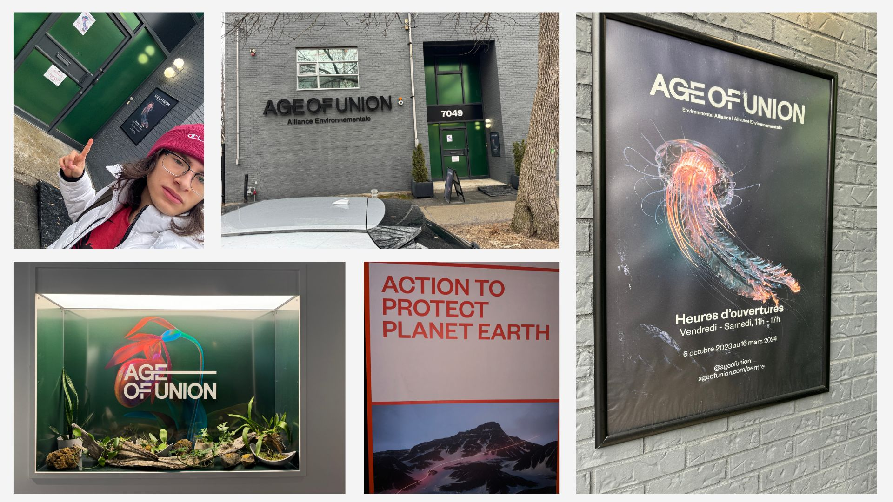
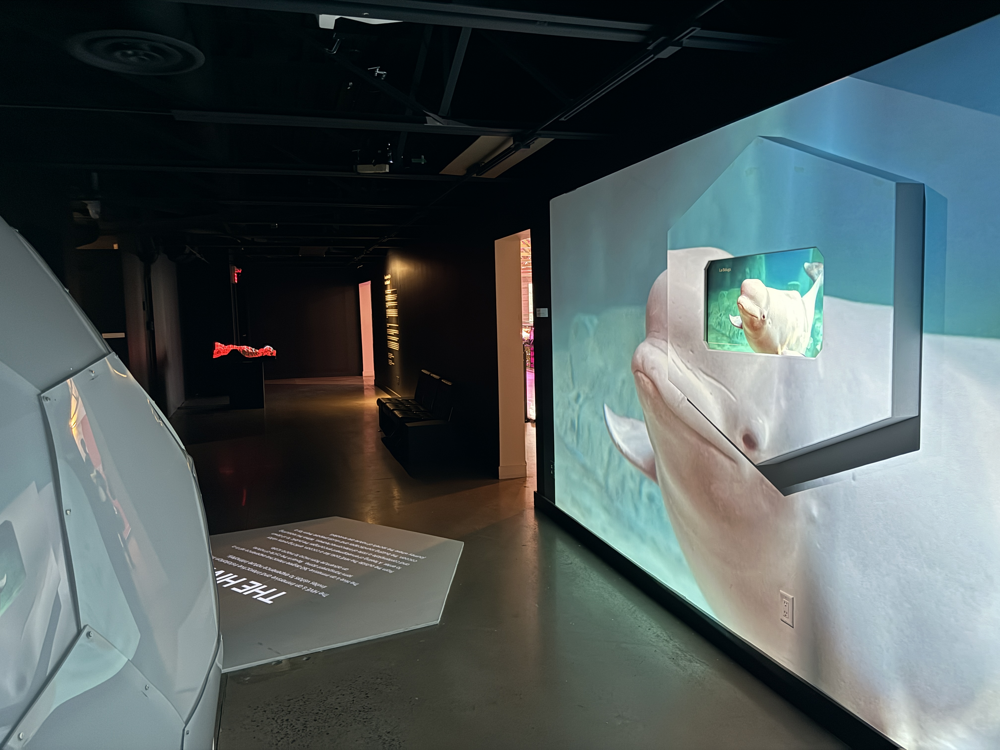

La ruche a nul part où s’assoir c long la transition entre chaque info ya pas de controle
ils auraient dû mettre une chaise et baisse l’ecran comme si s’etait un bureau avec un ecran tactile les gens s’ennuient de la longueur des infos
Si le senseur ne detecte personne l’œuvre ne se declanche pas
Mt concept pour les pieces
software Rhino sphere soccer ball
If one mesure is wrong it will not work like the bees
1/4 pieces to make the hexagons or the patagons none of them sre the same mesure
3 to 4 months to do the hold project du concept a la fin de la construction
100$ per filtre blanc
flatterie pour definir le plus moins de pieces possibles
moins de piece = moins cher
entre 60 et 70 pieces
nom du materiel:
sur la tablette on peut controler le son et d’autres réglages de la sphere

# Age of Union - The Hive

## Nom de l'exposition
Age of Union: The Hive

## Lieu de mise en exposition
7049 Rue Saint-Urbain, Montreal QC H2S 3H4

## Type d'exposition
Cette exposition est permanante. La date de fin n'est pas connue. Voici le lien dirigant à la collection permanante: (https://ageofunion.com/permanent-collection/)

## Date de ma visite
J'ai visité l'exposition le 2 mars 2024.

## Titre de l'oeuvre
The Hive

## Nom de l'exposition
Age of Union

## Année de réalisation
Entre 2023 et 2024 selon l'assembleur du dôme.

## Description
Age of Union est un communauté d'activistes qui cherche à conscentiser les personnes à travers l'art et l'éducation. C'est pour quoi il y a de nombreuses expositions différentes dans le même lieu. Cependant, l'oeuvre qui représente le mieux Age of Union est mon oeuvre. L'oeuvre que j'ai choisi s'appele The Hive. En français, cette dernière se nomme "La ruche". Elle porte ce nom pour une raison qui n'est pas très abstraite, mais elle est très ignorée. L'oeuvre est appelée ainsi pour montrer métaphoriquement les enjeux climatiques de notre planète avec une ruche d'abeille. La méthaphore montre qu'on a besoin de tous les écosystèmes de la planète pour que tout marche correctement, sinon les écosystèmes peuvent s'éffondre tel qu'une ruche d'abeille.

## Type d'installation 
Cette oeuvre est interactive. Le dôme est interactif parce qu'il y a des interactions possibles. Dès le moment, les interactions sont captés par des "Kinect" Xbox cachés dans le dôme en forme du ruche. L'écran en forme hexagonal juste à l'extérieur du dôme permet aussi des interactions quand l'utilisateur se promene dans l'écran tactile.

## Fonction du dispositif
[

## Mise en espace 
[

## Composantes et techniques 
The Hive est composé d'un grand aménagement. Du côté de l'écran en forme de ruche, il y a un écran tactile dedans un hexagone sur le mur. De plus, il y a deux projecteurs accrochés sur le pont d'éclairage. Du côté du dôme, il y a un projecteur suspendu avant de rentrer dans le dôme qui indique un message. À l'intérieur du dôme, il y a une planche circulaire qui tient quatres projecteurs et deux ventilateurs. Il y a quatre projecteurs sur la planche du toit qui complètent les angles morts. Il y a un projecteur à terre qui reflète la projection sur une boule de mirroir. Quand la projection est reflétée sur les murs du dôme, les plexiglass contienent un filtre blanc qui permet l'affichage des projections. À terre dans le quatre coins du dôme, il y a des quatres hauts-parleurs, quatres ventilateurs et quatre Kinect. Les Kinect détectent le mouvement à l'arrivée d'une personne poour déclancher la présentation. La disposition égale des composantes de l'oeuvre permet une distribution parfaite du vents et des sons dans le dôme. Sans oublier, le long cablage pour alimenter tous les électroniques depuis les sources d'électricité cachées dans les ponts d'éclairages du toit.

## Éléments nécessaires à la mise en exposition 
À l'écran en forme de ruche, il suffit de lire et choisir la catérgorie pour s'éduquer. À l'entrée du dôme un bref message qui explique quoi faire aux visiteurs. La présence du banc circulaire en toile permet aux personnes de s'assoir pour assiter la présentation. Il est nécessaire d'indiquer le début de l'expérience dans le dôme. Pendant la présentation, il est indiqué partout dans le dôme la possibilité d'interactions avec des mouvements. Ils ont bien poli le dôme parce que la présences de tous ces composantes ne sont pas imposantes. Le matériel est bien caché ou très peu visible dans l'obscurité. De plus, le sol est de la même couleur que celle des planches noires. 

## Expérience vécue

## Ce que j'ai aimé, ce qui m'a donné des idées
J'ai adoré cette sortie, parce que j'ai sous-estimé le lien intéressant entre la ruche et notre écosystème. J'ai appris à rechercher mieux mes sources grâce à mon échange exclusive avec le constructeur du dôme.
## Aspect que vous ne souhaiteriez pas retenir pour vos propres créations ou que vous feriez autrement et justifications
À mon opinion, l'écran tactile en forme d'hexagone aurait dû avoir des chaises pour s'assoir parce qu'il y avait trop d'informations. Si s'était mon oeuvre, les visiteurs seraient partis plus vite ce qui fait en sorte que mon oeuvre pert de l'audience et de la qualité. J'aurais aussi laissé le choix de pouvoir passer les diapositives rapidement parce qu'il manquait de dynamique et d'un bon rythme afin d'avoir une experience efficiante de qualité avec tous les visiteurs. 
# Informations additionnelles

## Derrière la scène

J'ai disscuté avec l'assembleur de nombreuse informations sur la fabrication du dôme. Il m'a montrer qu'il y avait une tableau, dont juste le personnel autorisé pouvait utiliser pour passer des scènes dans la présentation du dôme.
