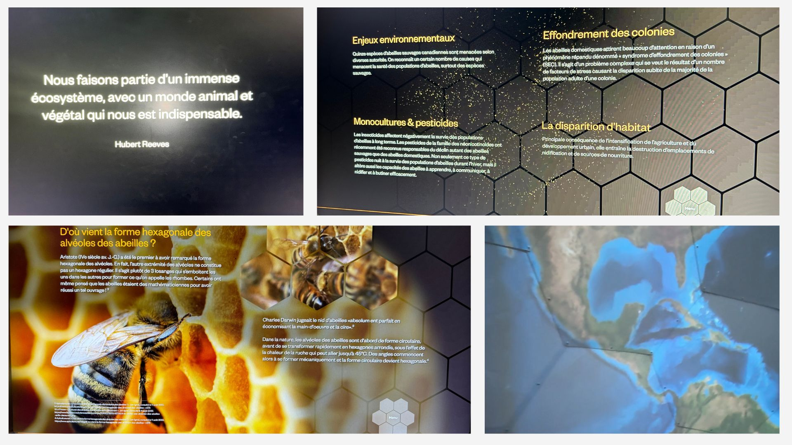
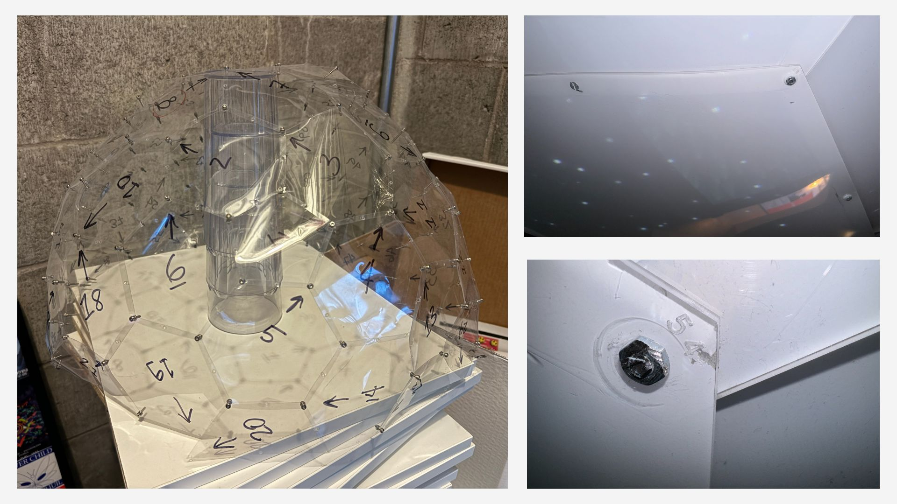
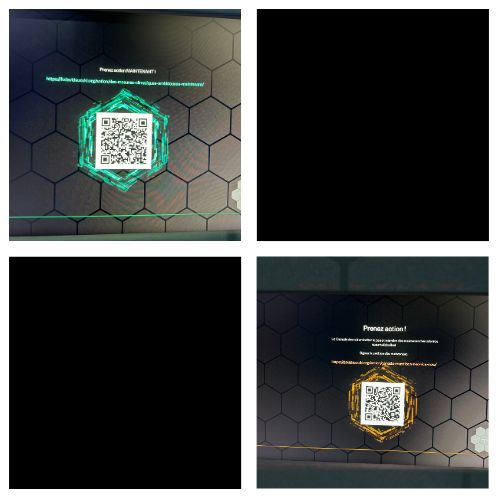

# Contextualisation de l'oeuvre
L'exposition "Age of Union" se situe dans le cadre pour la communauté d'activistes engagés dans la sensibilisation aux enjeux climatiques à travers l'art et l'éducation. En utilisant une métaphore visuelle, l'oeuvre "The Hive" explore les liens entre les écosystèmes naturels et les activités humaines.

# Description de l'oeuvre
"The Hive" est une installation interactive composée d'un dôme représentant une ruche d'abeilles et d'un écran tactile en forme d'hexagone. Les visiteurs peuvent interagir avec le dôme en bougent les bras. L'écran ruche permet de s'éduquer avec différentes catégories d'informations.

# Justification de l'appréciation
L'appréciation de l'oeuvre repose sur la transmission d'un message complexe de manière engageante et accessible. Il est possible de transmettre le message efficacement en se servant d'une structure qui soutient la vie sur terre. Dans ce cas, la ruche répresente l'équilibre de notre planète. L'équilibre est possible grâce à l'harmonie entre les écosystèmes. La métaphore de la ruche d'abeilles sert à représenter les enjeux climatiques. Cette représention offre une perspective nouvelle et poétique, incitant les spectateurs à réfléchir à l'impact de leurs actions sur l'environnement.

# Mise en relation avec d'autres expériences, oeuvres ou dispositifs
"The Hive" peut être comparée à d'autres installations artistiques qui utilisent des métaphores visuelles pour aborder des questions sociales ou environnementales. Par exemple, l'oeuvre "Rain Room" de Random International crée une expérience immersive où les visiteurs essayent de toucher la pluie artificielle. "Rain Room" et "The Hive" suscitant une réflexion sur la relation entre l'homme et la nature.

### Conscientisation en agissant

