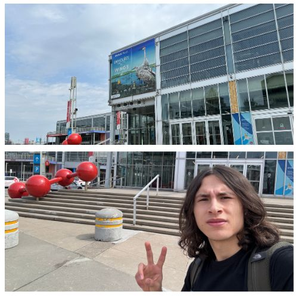
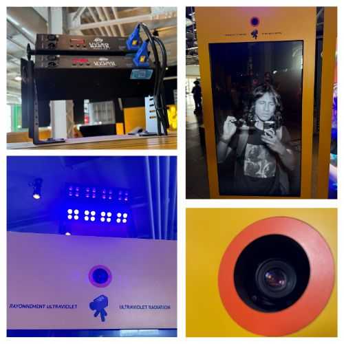
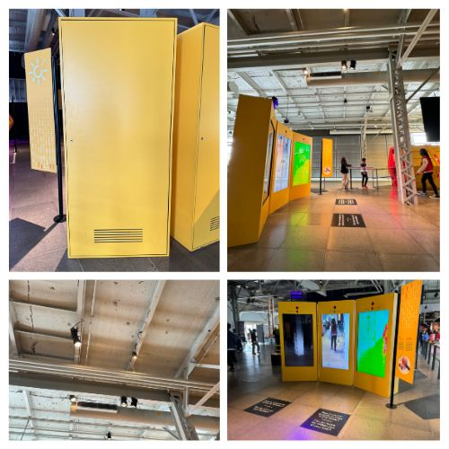
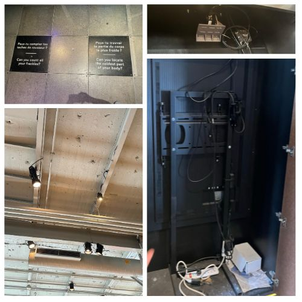
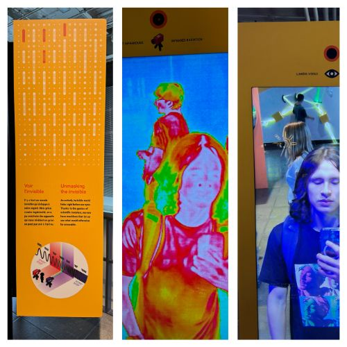
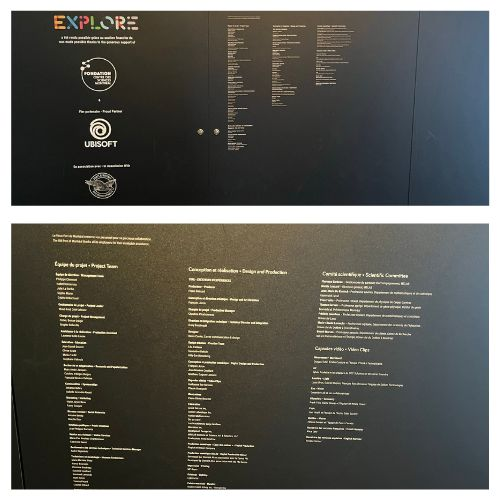

# Centre des sciences de Montreal - Explore - 3 Écrans avec différentes lumières captées

## Lieu de mise en exposition
2 Rue de la Commune Ouest, Montréal QC H2Y 4B2 

## Type d'exposition
Cette exposition est permanante ça fait presque 10 ans. C'est bientôt la fin.

## Date de ma visite
J'ai visité l'exposition le 10 avril 2024.

## Titre de l'oeuvre
Inconnu. Voir la description pour savoir comment ça marche. 

## Nom de l'exposition
Explore

## Année de réalisation
En 2015 environ

## Description
Cette oeuvre sert simplement à se voir de trois manières différentes. Dans le premier écran, on peut voir le monde sous l'effet des rayons ultraviolets. Cela permet de se voir en noir et blanc. Dans le deuxième écran, on peut voir le monde normalement. C'est juste un mirroir electronique. Dans le troisième, on peut voir le monde sous l'effet des rayons infrarouges. Cela permet de voir la température de toutes les personnes et les objets. 

## Type d'installation 
Cette oeuvre est interactive. Les trois écrans offrent la possibilité d'interagir en voyant différents objets ou personnes à travers la caméra. 

## Fonction du dispositif
Par exemple, je peux montrer le sac de mon ami à la caméra de rayons infrarouges pour voir quelle est la température. 

## Mise en espace 

## Composantes et techniques 
C'est la caméra de chacun des modules qui filme avec son propre filtre intégré. Il n'y a pas d'étapes de traitement. Les lumières au-dessus de celle du UV, sont là seulement pour créer plus de luminosité sur le participant afin que la caméra puisse bien le voir sur toute sa hauteur. Au toit, on retrouve quelques branchements pour les lumières qui illuminent les visiteurs.

## Éléments nécessaires à la mise en exposition 

## Expérience vécue

## Ce que j'ai aimé, ce qui m'a donné des idées
J'ai adoré cette sortie, parce que 

## Ce que je n'ai pas aimé, ce que je changerais
Je ferais en sorte que 

## Aspect que vous ne souhaiteriez pas retenir pour vos propres créations ou que vous feriez autrement et justifications
À mon opinion, 

# Informations additionnelles

Lien de l'exposition: https://www.centredessciencesdemontreal.com/exposition-permanente/explore

