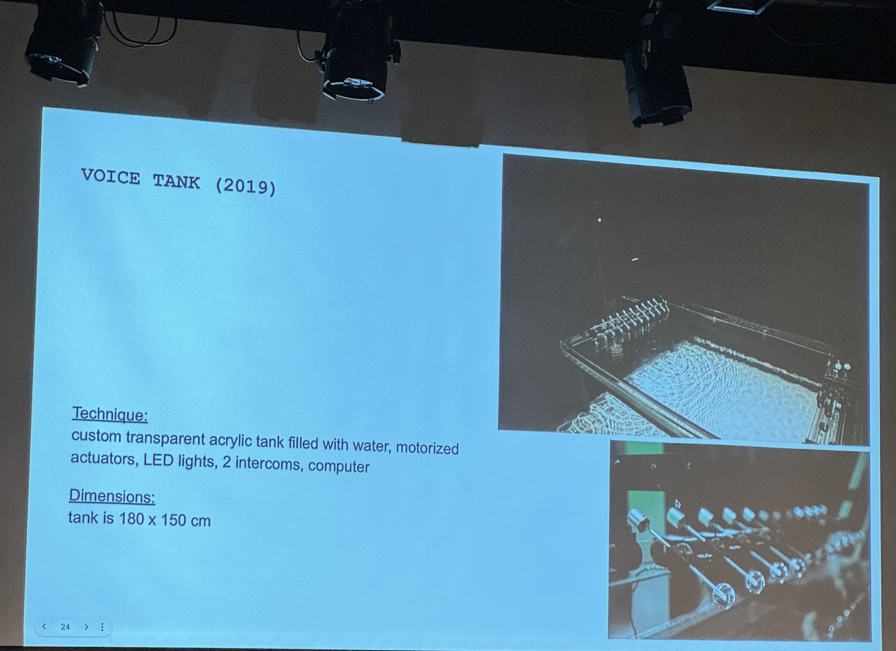
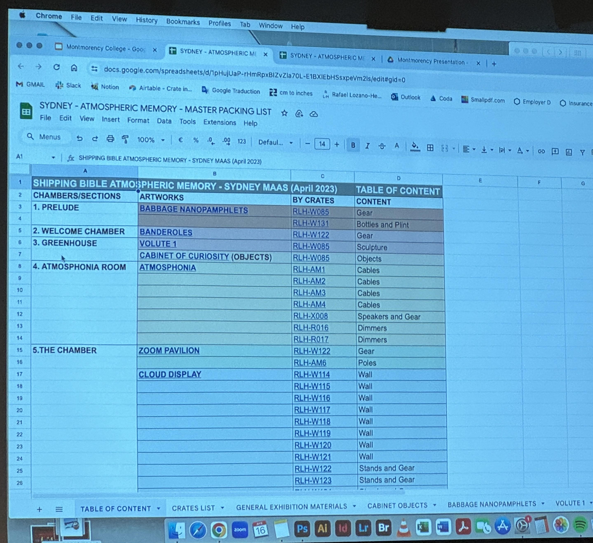

# Conférence de Jade Séguela #
La visite de Jade Séguela présente son travail et lui de son équipe. Son équipe de travail travaille au studio Antimodular Research. Ce studio est dirigé par l'artiste Rafael Lozano-Hemmer. Jade donne une brève description de l'artiste. Rafael a pour but d'engager les visiteurs. Rafael va toujours jusqu'au bout des institutions pour accomplir son rêve. Elle a décrit son lieu de travail à Antimodular Research. Il y a trois studios sur le plateau et il y a un endroit de stockage. Jade parle des différents rôles dans son équipe diversifiée. ELle présente son rôle de registraire. Son rôle constitue des tâches tel que l'import et l'export, la logistique, l'emballage d'oeuvre, le design de caisses, la conservation préventive, le constat d'état, la documentation, la possetion de l'inventaire, la gestion de l'entrepôt d'oeuvres et l'installation d'oeuvres. Jade raconte aussi que tout passe par elle avant de continuer à la prochaine étape suivant la conception. Elle suit chacunes

_«Nous ne sommes pas entrain de sauver des vies, nous faisons juste de l'art»_ 

-Rafael Lozano-Hemmer

Voici le répertoire du studio Antimodular pour plus d'informations:
https://github.com/antimodular/Best-practices-for-conservation-of-media-art

